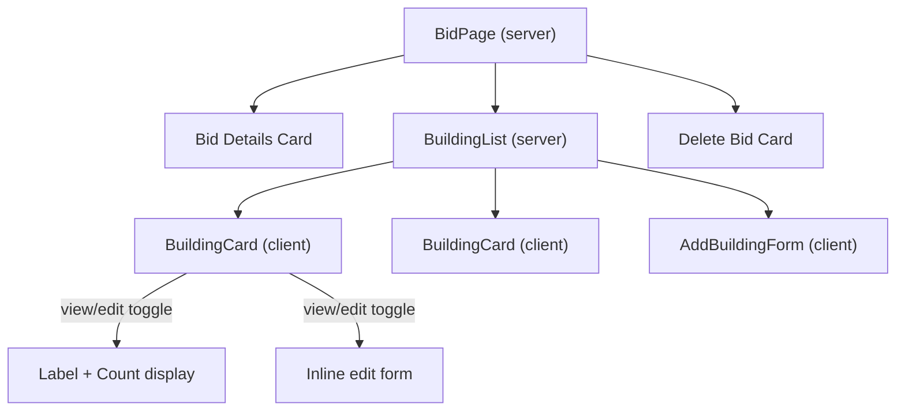
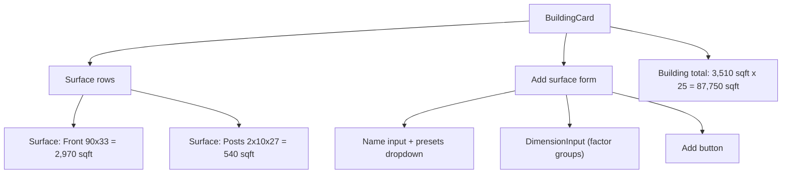

# Buildings and Surfaces Feature

## Current State

The bid detail page at `[src/app/bids/[id]/page.tsx](src/app/bids/[id]/page.tsx)` has a placeholder "Buildings" card with a disabled "Add building (coming soon)" button. The schema in `[src/db/schema.ts](src/db/schema.ts)` only has a `bids` table. Data access lives in `[src/lib/store.ts](src/lib/store.ts)`, server actions in `[src/lib/actions.ts](src/lib/actions.ts)`, validation in `[src/lib/validations.ts](src/lib/validations.ts)`.

---

## Phase A: Buildings

### Schema

Add a `buildings` table to `[src/db/schema.ts](src/db/schema.ts)`:

```typescript
export const buildings = pgTable("buildings", {
  id: uuid("id").primaryKey().defaultRandom(),
  bidId: uuid("bid_id").notNull().references(() => bids.id, { onDelete: "cascade" }),
  label: text("label").notNull(),       // e.g. "Six unit 3-story", "Parking covers"
  count: integer("count").notNull().default(1),
  sortOrder: integer("sort_order").notNull().default(0),
  createdAt: timestamp("created_at", { withTimezone: true }).notNull().defaultNow(),
  updatedAt: timestamp("updated_at", { withTimezone: true }).notNull().defaultNow(),
});
```

Key decisions:

- `onDelete: "cascade"` so deleting a bid removes its buildings
- `count` defaults to 1 (most ancillary structures are one-off)
- `sortOrder` for user-controlled ordering

Run `bun run db:push` after schema change.

### Data Layer

Add to `[src/lib/store.ts](src/lib/store.ts)`:

- `getBuildingsForBid(bidId)` — returns buildings ordered by `sortOrder`
- `createBuilding(bidId, { label, count })` — inserts with next sortOrder
- `updateBuilding(id, { label?, count? })` — partial update, scoped to user's bid
- `deleteBuilding(id)` — scoped to user's bid

Add to `[src/lib/validations.ts](src/lib/validations.ts)`:

- `createBuildingSchema` — bidId (uuid), label (min 1), count (int, min 1)
- `updateBuildingSchema` — id (uuid), label (min 1), count (int, min 1)
- `deleteBuildingSchema` — id (uuid)

Add to `[src/lib/actions.ts](src/lib/actions.ts)`:

- `createBuildingAction`, `updateBuildingAction`, `deleteBuildingAction`
- All redirect back to `/bids/[bidId]` after mutation (using `revalidatePath` instead of redirect where appropriate to avoid scroll-to-top)

### UI

On `[src/app/bids/[id]/page.tsx](src/app/bids/[id]/page.tsx)`, replace the placeholder Buildings card:

- **Building list** — each building renders as a Card showing label, count (e.g. "x25"), and total sq ft (placeholder "—" until surfaces exist). Each card has inline edit/delete.
- **Add building form** — an inline form at the bottom of the buildings section with label input, count input (numeric, default 1), and "Add" button. Uses the `SubmitButton` component for pending state.
- **Edit building** — clicking a building card opens an inline edit form (swap display for form). This should be a client component (`BuildingCard`) that toggles between view and edit mode.
- **Delete building** — small destructive button on each card, uses a form with hidden ID.

New components:

- `src/components/building-list.tsx` — server component that fetches and renders buildings for a bid
- `src/components/building-card.tsx` — `"use client"` component for view/edit toggle per building
- `src/components/add-building-form.tsx` — `"use client"` component for the inline add form




---

## Phase B: Surfaces

### Schema

Add a `surfaces` table to `[src/db/schema.ts](src/db/schema.ts)`:

```typescript
export const surfaces = pgTable("surfaces", {
  id: uuid("id").primaryKey().defaultRandom(),
  buildingId: uuid("building_id").notNull().references(() => buildings.id, { onDelete: "cascade" }),
  name: text("name").notNull(),          // e.g. "Front", "Porch Ceilings", "Posts"
  dimensions: jsonb("dimensions"),        // array of dimension groups: [[90, 33], [8, 3, 2]]
  totalSqft: numeric("total_sqft"),       // computed from dimensions, stored for query convenience
  sortOrder: integer("sort_order").notNull().default(0),
  createdAt: timestamp("created_at", { withTimezone: true }).notNull().defaultNow(),
});
```

The `dimensions` column stores an array of "groups." Each group is an array of numbers whose product is the group's sq ft. Groups are summed for the surface total. Example for "Porch Ceilings (8x3x2) + (17x8x9)":

```json
[[8, 3, 2], [17, 8, 9]]
```

Computed: (8*3*2) + (17*8*9) = 48 + 1224 = 1272 sq ft.

For raw sq ft entries like "Above soffit square footage 1000", store as `[[1000]]`.

### Data Layer

Add to `[src/lib/store.ts](src/lib/store.ts)`:

- `getSurfacesForBuilding(buildingId)` — ordered by sortOrder
- `createSurface(buildingId, { name, dimensions })` — computes totalSqft from dimensions
- `updateSurface(id, { name?, dimensions? })` — recomputes totalSqft
- `deleteSurface(id)`

Utility function in a new `[src/lib/dimensions.ts](src/lib/dimensions.ts)`:

- `computeTotalSqft(dimensions: number[][])` — multiply within groups, sum across groups

Update `getBuildingsForBid` to also return each building's total sq ft (sum of its surfaces' totalSqft).

### UI

Each `BuildingCard` expands to show its surfaces:

- **Surface rows** — each surface shows: name, dimension expression (e.g. "90 x 33"), computed sq ft. Inline edit/delete.
- **Dimension input component** — `src/components/dimension-input.tsx` (`"use client"`). Lets the user enter dimension factors separated by "x" (e.g. "90 x 33"). Support adding multiple groups with a "+" button (e.g. group 1 + group 2). Display computed total. Also support entering a single raw number for flat sq ft.
- **Add surface form** — inline form within the building card: surface name input + dimension input + "Add" button.
- **Surface presets** — a dropdown/popover with common surface names (Front, Back, Side A, Side B, Posts, Porch Ceilings, Porch Walls, Porch Side Bands, Porch Floors, Porch Steps, Above Soffit, Catwalks, Stairwells, Railings). Selecting a preset fills the name field. User can still type freely.
- **Running totals** — each building card shows total sq ft (sum of surfaces x building count). The Buildings section header shows grand total across all buildings.




---

## Files Changed / Created

**Modified:**

- `src/db/schema.ts` — add `buildings` and `surfaces` tables
- `src/lib/store.ts` — add building and surface CRUD functions
- `src/lib/actions.ts` — add building and surface server actions
- `src/lib/validations.ts` — add building and surface Zod schemas
- `src/app/bids/[id]/page.tsx` — replace placeholder with BuildingList

**Created:**

- `src/components/building-list.tsx` — server component, fetches buildings for a bid
- `src/components/building-card.tsx` — client component, view/edit/expand for one building
- `src/components/add-building-form.tsx` — client component, inline add form
- `src/components/surface-row.tsx` — client component, one surface line with edit/delete
- `src/components/add-surface-form.tsx` — client component, name + dimensions + add
- `src/components/dimension-input.tsx` — client component, factor group input with computed total
- `src/components/surface-presets.tsx` — client component, preset name dropdown
- `src/lib/dimensions.ts` — utility for computing sq ft from dimension groups

