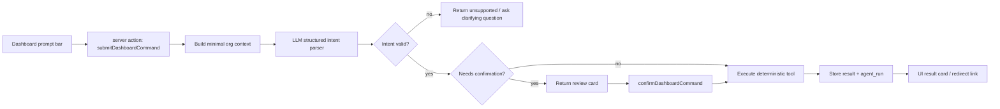

# Dashboard Prompt Command Bar — build plan

## Why this, why now

The dashboard is already the daily triage surface: pipeline totals, source filters,
lead drill-downs, bid counts, and project counts. A bottom prompt input can make
the app feel more AI-native immediately by letting Jordan start common actions in
plain language:

- "Add a lead for Pura Vida, managed by Highmark, follow up Friday"
- "Log that I called Sarah at Greystar today"
- "Start a draft bid for Pura Vida blue section"
- "Show overdue follow-ups"
- "How much open pipeline do we have from BAAA?"

But this must respect the PRD stance: Mercer is not a dashboard chatbot. The
prompt bar is a **command surface** over structured records and deterministic
tools. The model interprets; Mercer validates and executes.

This maps to `docs/plan.md` → **Open now**:

> **Specify the prompt-bidding boundary (pre-M2 design).**

This plan is the implementation-shaped version of that boundary for the first
dashboard slice.

## Product boundary

### What v1 is

- A bottom-of-dashboard prompt bar for initiating app actions.
- An LLM parser that converts natural language into a typed intent.
- A deterministic tool layer that performs allowed actions through existing
  store/action helpers.
- A review/confirmation step when the intent is ambiguous or writes meaningful
  business state.
- A lightweight "result card" that links to the record or filtered view.

### What v1 is not

- Not a general chat assistant.
- Not a bid-pricing oracle.
- Not a replacement for capture-first bidding.
- Not allowed to invent labor rates, access costs, margins, paintable square
  footage, legal owner/NTO data, proposal totals, or proposal copy.
- Not allowed to mutate destructive states: delete records, mark won/lost,
  accept/decline proposals, start crews, generate public proposal links, or send
  customer communication.

## V1 capabilities

Prioritize low-risk actions that prove the interaction model:

1. **Navigate / filter**
   - "Show BAAA won leads" → `/leads?source=BAAA&status=won`
   - "Open projects in punch out" → `/projects?status=punch_out`

2. **Create lead shell**
   - "Add a lead for Vista Palms managed by Greystar"
   - Required fields: property/account name or enough text to form a lead.
   - Optional fields: address, contact name, email, phone, source tag,
     follow-up date.
   - If address/contact is missing, create the shell only after review.

3. **Log outreach**
   - "Log that I called Maria at Highmark today"
   - Requires matching a known contact/lead or asking the user to choose.
   - Uses the existing outreach event path (`logLeadContact` equivalent).

4. **Set follow-up**
   - "Remind me to follow up with Sarah Friday"
   - Requires contact/lead match and a parsed date.
   - Uses the existing follow-up path.

5. **Create draft project/bid shell**
   - "Start a draft bid for Pura Vida blue section"
   - Creates a draft scoped opportunity linked to a property when the property
     match is clear.
   - No generated price. No proposal. No rate invention.

6. **Basic dashboard answers**
   - "What is open pipeline from BAAA?"
   - Answer from existing aggregate getters, not model-generated arithmetic.

## Intent contract

Create a server-only schema, likely in `src/lib/agents/dashboard-command.ts` or
`src/lib/dashboard-command/schema.ts`.

```ts
type DashboardCommandIntent =
  | {
      type: "navigate";
      target: "leads" | "projects" | "bids" | "dashboard";
      filters: Record<string, string>;
      confidence: number;
    }
  | {
      type: "create_lead";
      fields: {
        propertyName?: string;
        accountName?: string;
        address?: string;
        contactName?: string;
        email?: string;
        phone?: string;
        sourceTag?: string;
        followUpAt?: string;
      };
      missingFields: string[];
      confirmationRequired: true;
      confidence: number;
    }
  | {
      type: "log_contact" | "set_follow_up";
      entityRef: { leadId?: string; contactId?: string; propertyId?: string };
      fields: Record<string, string>;
      missingFields: string[];
      confirmationRequired: boolean;
      confidence: number;
    }
  | {
      type: "create_project";
      fields: {
        propertyId?: string;
        propertyName?: string;
        label?: string;
        primaryContactId?: string;
      };
      missingFields: string[];
      confirmationRequired: true;
      confidence: number;
    }
  | {
      type: "answer_dashboard_question";
      metric: "open_pipeline" | "won_booked" | "lead_count" | "bid_count";
      filters: Record<string, string>;
      confidence: number;
    }
  | {
      type: "unsupported";
      reason: string;
      confidence: number;
    };
```

Implementation detail: keep this as Zod schemas, not hand-rolled types. The
model output must parse through the schema before any tool runs.

## Architecture



### Server modules

- `src/lib/agents/dashboard-command/schema.ts`
  Zod intent contracts, result contracts, prompt version constant.

- `src/lib/agents/dashboard-command/parse.ts`
  Server-only LLM call with structured output. The prompt should explicitly say:
  parse intent only; do not calculate totals; do not invent missing values; mark
  low-confidence or unsupported requests.

- `src/lib/agents/dashboard-command/context.ts`
  Builds minimal candidate context for entity matching:
  recent properties, contacts, source tags, dashboard aggregate names, maybe top
  follow-ups. Keep it bounded.

- `src/lib/agents/dashboard-command/tools.ts`
  Deterministic execution layer. Calls existing store helpers and new small store
  helpers as needed.

- `src/lib/actions/dashboard-command.ts` or add to `src/lib/actions.ts`
  `submitDashboardCommandAction` and `confirmDashboardCommandAction`.

### UI modules

- `src/components/dashboard-command-bar.tsx`
  Client component with prompt input, submit button, loading state, error state,
  result card, confirmation card.

- `src/app/(app)/dashboard/page.tsx`
  Render the command bar after dashboard data. Prefer sticky bottom placement
  that does not cover dashboard cards on mobile.

## Data model

Add a manual migration:

`drizzle/manual/021_agent_runs.sql`

Recommended broad table name because PRD §6 already names `agent_run` as a core
AI-native entity:

```sql
CREATE TABLE agent_runs (
  id uuid PRIMARY KEY DEFAULT gen_random_uuid(),
  user_id uuid NOT NULL,
  agent_type text NOT NULL,
  prompt_version text NOT NULL,
  model text,
  input_text text NOT NULL,
  parsed_intent jsonb,
  tool_calls jsonb,
  status text NOT NULL,
  error text,
  cost_usd numeric,
  started_at timestamptz NOT NULL DEFAULT now(),
  completed_at timestamptz
);

CREATE INDEX agent_runs_user_type_started_idx
  ON agent_runs (user_id, agent_type, started_at DESC);
```

Statuses: `parsed`, `needs_confirmation`, `succeeded`, `failed`,
`unsupported`.

Store ownership rule: `user_id` must use the org owner id, matching the current
multi-user pattern.

## Prompt and model rules

- Use a current low-latency model through direct API calls for v1.
- Put the prompt version in code, not DB config.
- Always require structured output.
- Supply only bounded context:
  - current dashboard source filter
  - source tags
  - relevant recent/open leads and properties by name
  - dashboard aggregate labels
- Never supply private customer proposal snapshots unless a later, explicit tool
  needs them.
- If confidence is low, return a clarifying question or `unsupported`; do not
  guess.

## Deterministic tool rules

Every tool must:

- Re-check auth and org ownership server-side.
- Validate input with Zod before writing.
- Use existing store helpers first.
- Return a typed result with a canonical link.
- Revalidate affected paths.
- Persist an `agent_runs` row whether it succeeds or fails.

Pricing-specific guardrail:

- The model may extract **inputs** such as "150k paintable sf", "swing stage",
  or "40% GP target" into structured fields.
- The model may not calculate price.
- Any future prompt-bidding tool must call `rate_config` + `calculateBidPricing`
  or a successor deterministic engine.
- Missing rates must block pricing and send the user to settings/review.

## UX details

Place the command bar at the bottom of the dashboard viewport:

- Desktop: centered max-width container, sticky bottom, subtle border/background,
  one-line input, submit icon button, optional suggestion chips above or inside
  the bar.
- Mobile: full-width bottom bar with enough bottom padding so content is not
  hidden behind it.
- Suggested chips should be actions, not explanatory copy:
  - `Add lead`
  - `Log call`
  - `Set follow-up`
  - `Start draft bid`
  - `Show overdue`
- Result card examples:
  - "Lead created: Vista Palms" with `Open lead`
  - "Follow-up set for Friday" with `Open contact`
  - "I need a property match before I can start that draft."

Avoid a chat transcript in v1. One input, one result, one review step.

## Phased implementation

### Phase 0 — Boundary and scaffolding

- Add this build plan and link it from `docs/plan.md`.
- Decide the exact v1 allowed-intent list.
- Choose model/provider consistent with existing app env.

### Phase 1 — Read-only / navigation slice

- Build command bar UI.
- Add intent schema and parser.
- Support `navigate` and `answer_dashboard_question` only.
- Persist `agent_runs`.
- Verify fallback when no API key is present.

This proves the UI and parser without writes.

### Phase 2 — Safe writes

- Add `create_lead`, `log_contact`, and `set_follow_up`.
- Add confirmation card for all writes.
- Add entity matching and ambiguity handling.
- Revalidate relevant pages.

### Phase 3 — Draft bid shell

- Add `create_project` / draft bid shell creation from property.
- Link to the bid edit page for surfaces/access/pricing.
- Preserve the pricing boundary: no generated total.

### Phase 4 — Prompt-bidding pre-M2 extension

- Allow extracting structured scope inputs from a prompt into draft fields:
  paintable sqft, building archetype, access method, margin target.
- Feed only validated numeric inputs into the deterministic pricing engine.
- If rates are missing, block and route to settings/review.

## Verification

Minimum before marking shipped:

- `bunx tsc --noEmit`
- `bun run lint`
- `bun run build`
- Manual dashboard checks:
  - no API key graceful failure
  - navigation intent
  - unsupported/destructive request
  - create lead confirmation
  - log contact / set follow-up with ambiguous match
  - draft bid shell creates no generated price

## Open decisions

- Model/provider: reuse Anthropic direct calls from onboarding, or introduce a
  separate provider abstraction now?
- Should `agent_runs` be broad now, or start with `prompt_command_runs` and
  migrate later?
- Which safe write should ship first: create lead or log contact?
- Should prompt bar appear only on `/dashboard`, or eventually in the global app
  shell? V1: dashboard only.
- How much recent entity context is enough for matching without bloating prompt
  cost?
